# Chronicle Studio — User Interface Guide & Handbook

Welcome to the **Chronicle Studio User Interface Handbook**. Chronicle is a unified, 100% local-first authoring, worldbuilding, and publishing suite built exclusively for novelists, storytellers, and long-form prose writers.

This handbook details how to navigate the studio, customize your writing environment, switch between **Studio**, **Minimalist**, and **Typewriter Zen** modes, construct multi-strand narrative timelines, analyze cast heatmaps, and produce publication-ready books.

---

## Table of Contents
1. [Chapter 1: Getting Started](#chapter-1-getting-started)
2. [Chapter 2: The Studio Interface & Navigation](#chapter-2-the-studio-interface--navigation)
3. [Chapter 3: Distraction-Free Modes: Studio, Minimalist & Typewriter Zen](#chapter-3-distraction-free-modes-studio-minimalist--typewriter-zen)
4. [Chapter 4: Settings, Themes & Workspace Customization](#chapter-4-settings-themes--workspace-customization)
5. [Chapter 5: Visual Narrative Timeline Studio](#chapter-5-visual-narrative-timeline-studio)
6. [Chapter 6: Cast Presence Heatmap & Character Grid](#chapter-6-cast-presence-heatmap--character-grid)
7. [Chapter 7: Worldbuilding Codex (Characters & Locations)](#chapter-7-worldbuilding-codex-characters--locations)
8. [Chapter 8: Reading Mode, Offline Neural TTS & Book Cover Designer](#chapter-8-reading-mode-offline-neural-tts--book-cover-designer)
9. [Chapter 9: Publication & Multi-Format Export Hub](#chapter-9-publication--multi-format-export-hub)
10. [Chapter 10: Keyboard Shortcuts & Power-User Workflows](#chapter-10-keyboard-shortcuts--power-user-workflows)

---

## Chapter 1: Getting Started

### 100% Local-First Architecture
* **Zero Telemetry**: Chronicle collects no metrics, has no trackers, and maintains no remote database.
* **100% GenAI-Free**: No LLMs. No text generation. Built exclusively for human writers.
* **No Cloud Lock-in**: Your work is saved in the open `.chronicle` format (a standard ZIP archive containing plain JSON and raw XHTML).
* **Optional Private Sync**: Sync directly to your own self-hosted WebDAV server (Nextcloud, ownCloud, Fastmail) with end-to-end credential storage.

### Creating or Loading Manuscripts
1. **Starting with the Sample Manuscript**:
   When launching Chronicle, click **"Open Sample Project"** on the welcome dialog to load a complete pre-configured edition of *Alice's Adventures in Wonderland*, populated with chapters, character profiles, narrative timeline beats, and cast heatmaps.
2. **New Blank Book**:
   Click **"New Project"** to initialize a clean manuscript structure with an initial chapter.
3. **Importing Existing Books**:
   Drag and drop any standard `.epub` or `.chronicle` file anywhere into the studio window, or press `Ctrl+O` to open the file browser.

---

## Chapter 2: The Studio Interface & Navigation

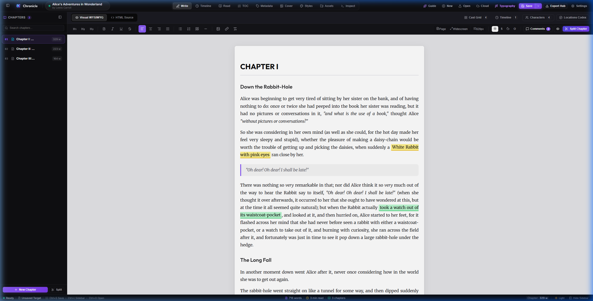
*Figure 2.1: The default Studio Mode workspace featuring the Top View Switcher tabs, Chapter Binder on the left, WYSIWYG writing canvas in the center, and live session word telemetry at the bottom.*

The workspace is organized into four main areas:

### 1. Top Navigation Bar
* **Book Title & Author**: Click the manuscript title to rename the project or edit book metadata (Language, Publisher, ISBN, Description).
* **View Switcher Tabs**:
  * **`Write`**: Manuscript drafting with the WYSIWYG editor and chapter binder.
  * **`Read`**: Distraction-free reader view for proofreading flow and pagination.
  * **`Timeline`**: Multi-strand narrative timeline plotting matrix.
  * **`Cast Grid`**: Chapter-by-chapter character presence density matrix.
  * **`Codex`**: Worldbuilding dossiers for characters and sensory locations.
  * **`Cover`**: Built-in graphic book cover designer.
  * **`Styles`**: Direct CSS stylesheet editor for advanced EPUB typography.
  * **`Metadata`**: Publication package details and Dublin Core attributes.
  * **`Inspect`**: Raw XHTML code viewer and spine hierarchy inspector.
* **Quick Tools**: Quick triggers for Offline Kokoro Neural Audio Proofreading, Smart Typography formatting, Export Hub, and Settings.

### 2. The Chapter Binder Sidebar
* **Organize Scenes**: Reorder chapters by dragging and dropping them vertically in the binder list.
* **Add Chapters**: Click the `+` button in the binder header to create a new scene.
* **Chapter Word Counts**: Each chapter card displays live word count statistics.
* **Quick Toggle**: Press `Ctrl+\` to collapse or expand the chapter binder.

### 3. WYSIWYG Manuscript Canvas
* Clean, distraction-free rich-text editing with customizable margins, typography, and line spacing.
* Select any passage to attach dual-view author notes and review comments.

### 4. Bottom Status Bar
* Live session velocity telemetry (`+X words today`).
* Active chapter word count and total manuscript progress.
* Estimated reading time and selected text metrics.

---

## Chapter 3: Distraction-Free Modes: Studio, Minimalist & Typewriter Zen

Writing requires different mental states depending on whether you are structuring scenes, reviewing comments, or drafting prose in deep flow. Chronicle provides three calibrated focus tiers:

| Mode | Shortcut | Best For | Key Features |
| :--- | :--- | :--- | :--- |
| **Studio Mode** | Default | Structuring, Outlining, Codex | Full multi-pane workspace with binder, toolbars, and status telemetry |
| **Minimalist Mode** | `Alt+M` | Drafting with quick tab access | Conceals sidebars and status bars; keeps view switching one click away |
| **Typewriter Zen Mode** | `Alt+Z` (Exit with `Esc`) | Deep-work flow state writing | Zero window chrome, eye-level typewriter scroll, 35% focus dimming, Ghost HUD |

### Minimalist Mode (`Alt+M`)
Conceals the chapter binder, secondary toolbars, and status bar, presenting an expansive manuscript canvas while preserving top view switching tabs.

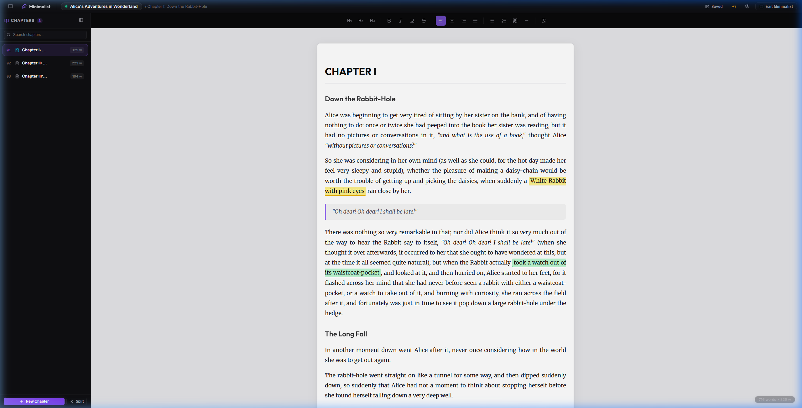
*Figure 3.1: Minimalist Mode active with hidden toolbars, distraction-free canvas, and an unobtrusive Exit Minimalist button.*

### Typewriter Zen Mode (`Alt+Z`)
Zen Mode is Chronicle's ultimate deep-work environment. It completely unmounts all window borders, headers, toolbars, and menus for a 100% distraction-free writing flow.

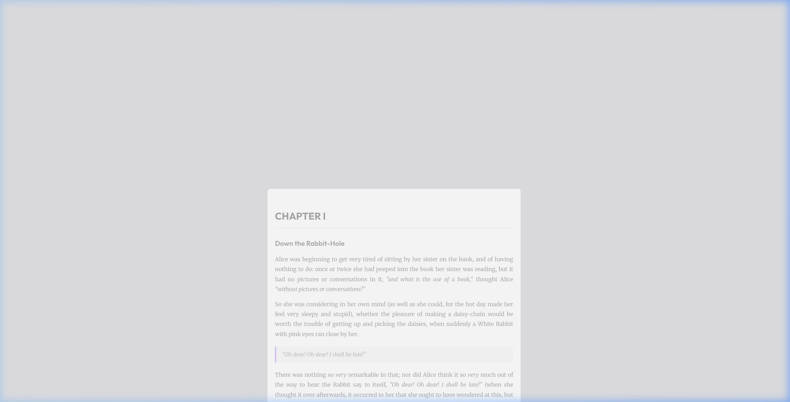
*Figure 3.2: Zen Mode active. Pure zero UI while typing, centered typewriter eye-level lock, and surrounding paragraph dimming.*

#### The 4 Core Zen Mechanics:
1. **Typewriter Scrolling**:
   Keeps the active typing line vertically centered on screen at natural eye level. As you write, text scrolls upwards underneath your cursor, preventing neck and back strain.
2. **Paragraph Focus Dimming**:
   Spotlights your active thought by illuminating the cursor's paragraph at 100% opacity while softly fading all surrounding paragraphs to 35% opacity.
3. **The Ghost HUD (Zero UI)**:
   Pure zero UI while writing. The moment you move your mouse, a faint, frosted-glass capsule appears showing your session word count (`+X words today`), active chapter, and an interactive chapter navigator to change scenes without leaving Zen mode.
4. **Hide Comments & Highlights**:
   Conceals margin comment cards and highlighted spans so editorial review notes do not disrupt drafting momentum.

> **Tip: Auto-Switch on Typing**  
> In `Settings > Appearance`, enable **"Switch to Zen Mode on typing"**. Chronicle will automatically transition into Zen mode the moment you begin typing in the manuscript, and return to Studio mode when you press `Esc`.

---

## Chapter 4: Settings, Themes & Workspace Customization

Press `Ctrl+,` or click the gear icon in the header to open the expanded Settings dialog.

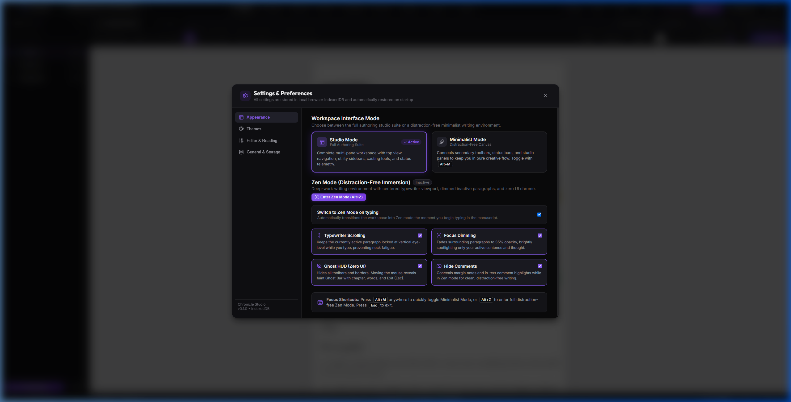
*Figure 4.1: The Appearance Settings section with workspace mode options, Zen mechanics toggles, and shortcut references.*

### Decoupled UI Themes vs. Manuscript Canvas Paper Tones
Chronicle decouples your studio application chrome theme from your writing canvas paper tone:

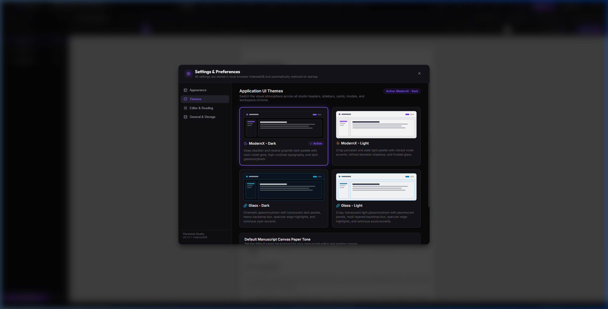
*Figure 4.2: The Themes Settings section featuring live UI theme previews and manuscript paper tone presets.*

* **Application UI Themes**:
  * **ModernX Dark**: Deep obsidian graphite with violet neon accents.
  * **ModernX Light**: Porcelain and slate surfaces with warm amber accents.
  * **Cyberpunk Dark**: Midnight backdrop with electric cyan highlights.
* **Manuscript Canvas Paper Tones**:
  * **Light**: Crisp warm white book paper with dark charcoal typography.
  * **Sepia**: Warm antique cream paper with soft amber-sepia text.
  * **Dark**: Muted charcoal backdrop with gentle off-white text.
  * **Obsidian**: True pitch-black canvas with clean high-contrast lettering.

### Private WebDAV Cloud Storage
Configure automatic synchronization to your own self-hosted Nextcloud, ownCloud, Fastmail, or custom WebDAV server with zero monthly cloud fees and end-to-end credential privacy.

---

## Chapter 5: Visual Narrative Timeline Studio

Click the **"Timeline"** tab to open the multi-strand narrative plotting matrix.

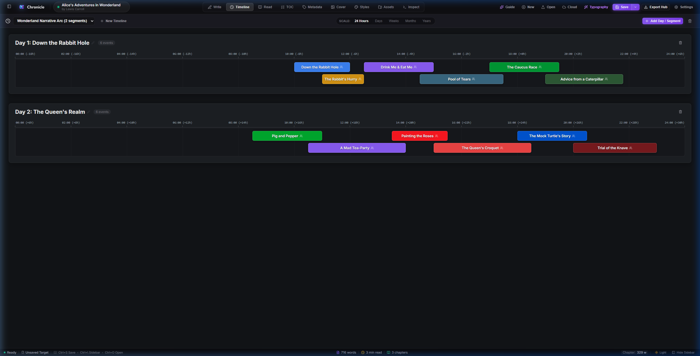
*Figure 5.1: Timeline Studio displaying narrative segments (Day 1, Day 2), parallel track lanes, and character-linked event cards.*

### How to Create & Manage Narrative Timelines:
1. **Create Narrative Segments**:
   Click **"+ New Segment"** to establish narrative containers (e.g., *Act I: The Rabbit Hole*, *Day 2: The Queen's Realm*). Each segment defines a temporal container with its own timescale (hours, days, months) and zero-hour calibration.
2. **Add Plot Events**:
   Click **"+ Add Event"** to place a story beat card on the canvas. Configure start time, duration, track lane (0, 1, 2, ...), title, description, and color palette.
3. **Assign Participating Characters**:
   Tag characters from your Codex who participate in the event. Character tags render with their designated theme colors directly on the timeline card.

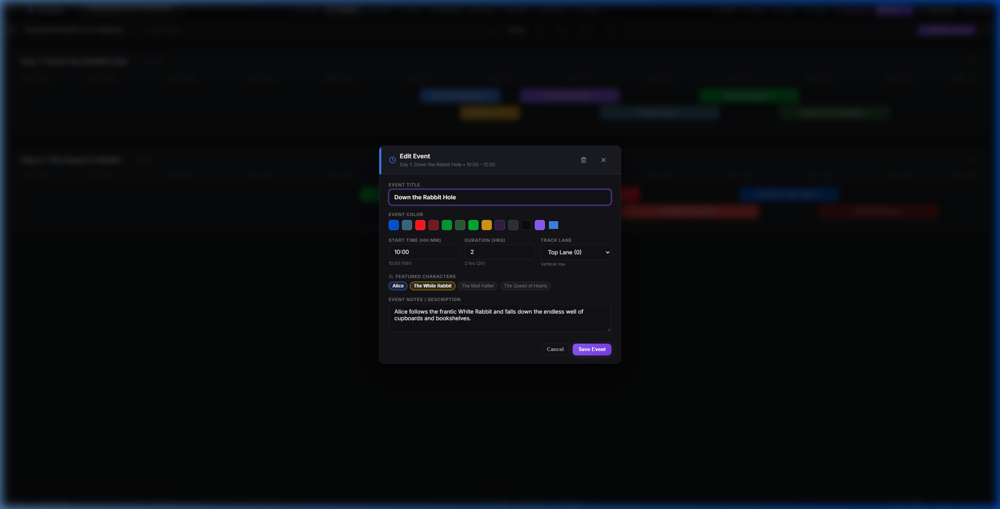
*Figure 5.2: Story Event editing dialog showing title, duration, track lane assignment, narrative description, and linked characters.*

> **Continuity & Collision Prevention**:  
> By distributing parallel plotlines across multiple horizontal lanes, Chronicle makes impossible character overlaps instantly visible—such as a character appearing in two distant places at the same time.

---

## Chapter 6: Cast Presence Heatmap & Character Grid

Click the **"Cast Grid"** tab to inspect character screen-time balance across chapters.

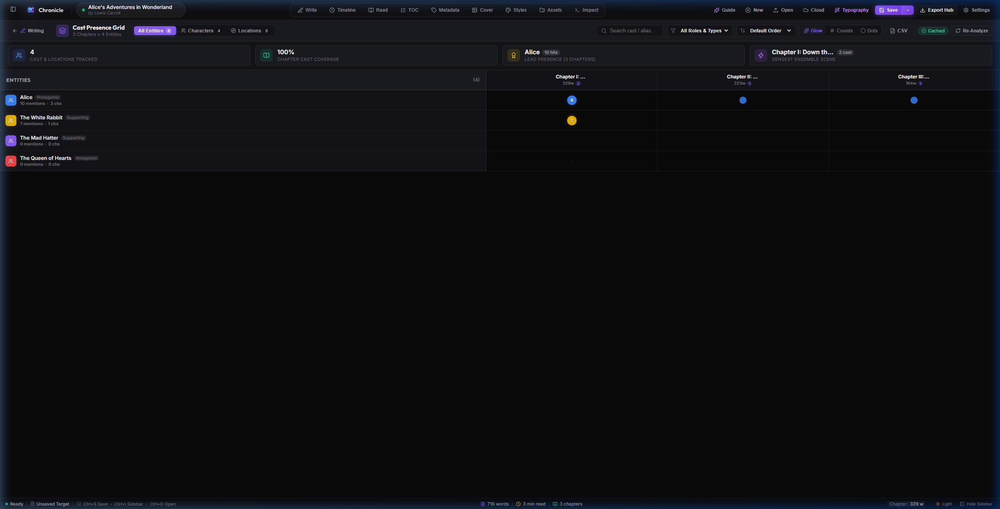
*Figure 6.1: Cast Presence Grid with chapter columns along the horizontal axis, character profiles along the vertical axis, and density heat nodes.*

### Key Capabilities:
* **Audit Screen Time**: Circular color nodes visually demonstrate where each character appears and how frequently they speak or are mentioned.
* **Identify Missing Character Arcs**: Quickly notice if a major protagonist or villain disappears for multiple consecutive chapters.
* **Display Toggles**: Switch between *Glow* (vibrant heat bubbles), *Counts* (exact in-text mention numbers), and *Dots* (compact presence indicators).
* **Click-to-Inspect Dialogue**: Click any node to read dialogue excerpts and scene snippets, with a one-click button to jump straight into that chapter.
* **Export Matrix**: Click *Export CSV/TSV* to save the matrix to a spreadsheet for editorial analysis.

---

## Chapter 7: Worldbuilding Codex (Characters & Locations)

Click the **"Codex"** tab to manage your novel's worldbuilding bible.

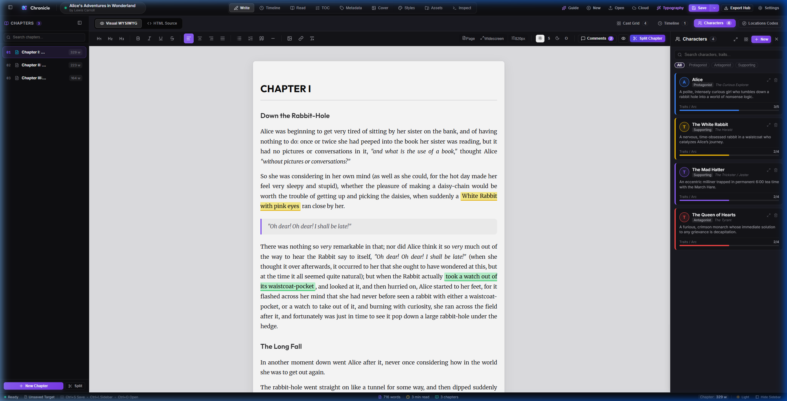
*Figure 7.1: Character Codex profile drawer displaying archetype, role, physical appearance, psychological traits, and goals checklist.*

* **Character Profiles**:
  * Role (Protagonist, Antagonist, Supporting, Mentor).
  * Archetype, age, occupation, and aliases.
  * Physical appearance description and psychological motivation.
  * Interactive Trait & Goal Checklist that tracks completed character milestones.
* **Sensory Location Dossiers**:
  * Sights, sounds, smells, atmospheric weather, and temperature.
  * Historical lore, societal significance, and environmental hazards.
  * Interactive Landmark Checklist for tracking explored locations.

---

## Chapter 8: Reading Mode, Offline Neural TTS & Book Cover Designer

### 1. Reader Mode (`Read` Tab)
Publication-accurate reading view with customizable column widths (560px to 1080px), adjustable book typefaces, and reading progress indicators.

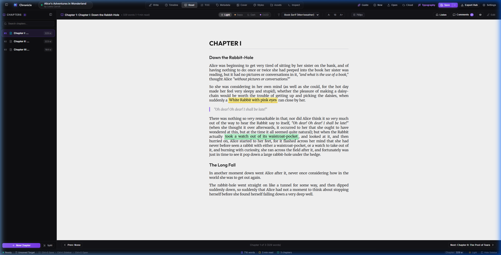
*Figure 8.1: Reader Mode showing comfortable margins, warm sepia paper tone, and chapter progress indicators.*

### 2. Offline Kokoro Neural Audio Proofreading
Catch clumsy phrasing, dialogue cadence hitches, and typos by listening to your prose read aloud by state-of-the-art Kokoro neural voice models running directly in your browser via WebGPU and WebAssembly. No text is ever transmitted over the network.

### 3. Built-In Graphic Book Cover Designer
Click the **"Cover"** tab to design publication-grade ebook covers directly inside Chronicle without external graphics tools.

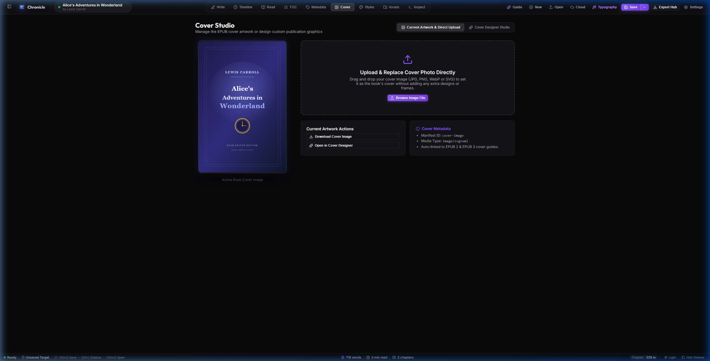
*Figure 8.2: Built-in Book Cover Designer showing title typography controls, genre emblems, color palettes, and high-resolution export.*

---

## Chapter 9: Publication & Multi-Format Export Hub

Click **"Export Hub"** in the header toolbar to generate bookstore-ready files:

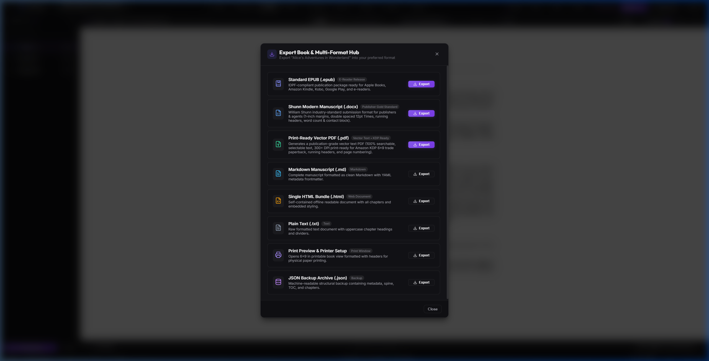
*Figure 9.1: The Export Hub dialog with one-click publication targets for PDF, EPUB 3, Shunn DOCX, and Project Backups.*

* **Print PDF Typesetter**: Formatted for physical print-on-demand (6x9, 5.5x8.5, A5). Features automated mirror margins, running headers, Roman numeral front matter, and scaled drop caps.
* **Standard EPUB 3**: Verified, reflowable EPUB 3 ebooks passing EpubCheck validation for Amazon Kindle, Apple Books, and Kobo.
* **William Shunn DOCX**: Submission-ready Word document adhering strictly to the industry-standard William Shunn manuscript guidelines required by literary agents and traditional publishers.
* **Chronicle Project (`.chronicle`)**: Comprehensive portable ZIP package containing all drafts, codex dossiers, timelines, covers, and author comments.

> **Zero-Leakage Export Guarantee**:  
> All author review comments, editorial notes, and temporary highlights are automatically stripped during publication exports, guaranteeing that your published PDF, EPUB, or DOCX files are pristine.

---

## Chapter 10: Keyboard Shortcuts & Power-User Workflows

| Shortcut | Action | Scope |
| :--- | :--- | :--- |
| <kbd>Alt+M</kbd> | Toggle Minimalist Mode (conceals toolbars and status bar) | Global |
| <kbd>Alt+Z</kbd> | Toggle Typewriter Zen Mode (zero UI deep-work immersion) | Global |
| <kbd>Esc</kbd> | Quick Exit from Zen Mode / Close any open modal dialog | Global |
| <kbd>Ctrl+S</kbd> | Save Manuscript & Project Backup (Local / Cloud) | Global |
| <kbd>Ctrl+O</kbd> | Open File / Import EPUB or Chronicle Project | Global |
| <kbd>Ctrl+,</kbd> | Open Settings & Preferences Dialog | Global |
| <kbd>Ctrl+\</kbd> | Toggle Chapter Binder Sidebar Visibility | Write View |
| <kbd>Ctrl+B</kbd> | Bold text formatting | Editor |
| <kbd>Ctrl+I</kbd> | Italic text formatting | Editor |
| <kbd>Ctrl+Z</kbd> | Undo text edit | Editor |
| <kbd>Ctrl+Y</kbd> | Redo text edit | Editor |

---

*Chronicle is open-source under the AGPLv3 License. Built exclusively for human writers.*
